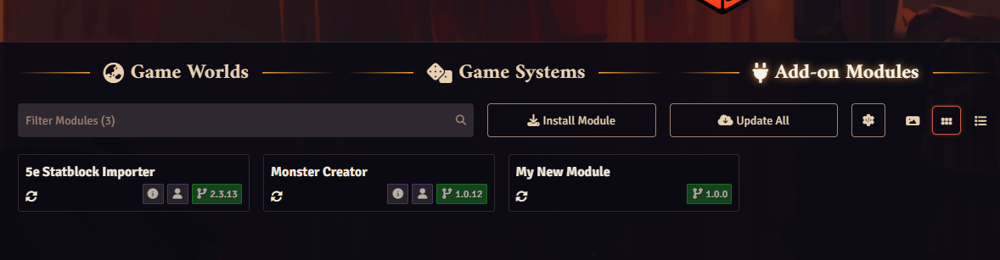
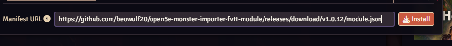
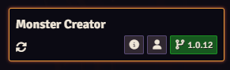
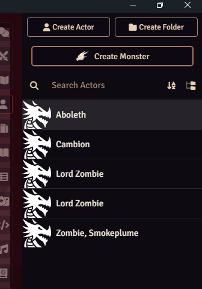
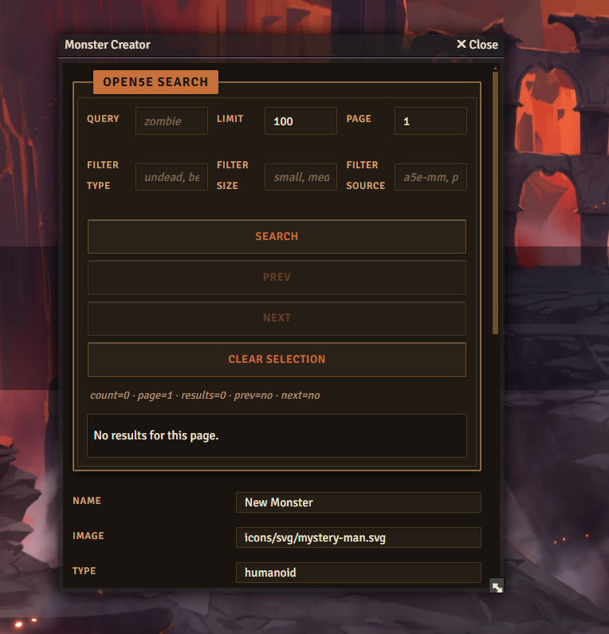
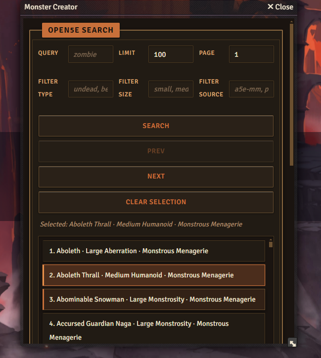
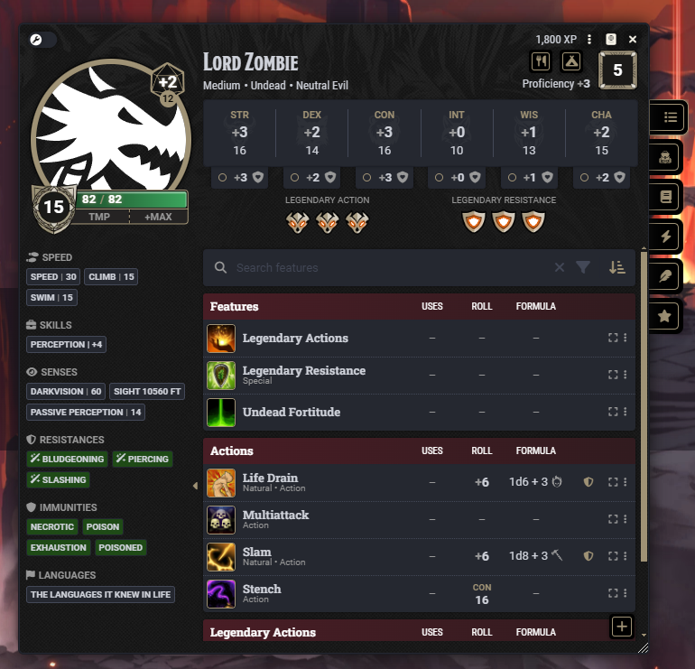

# Monster Creator

Monster Creator is a full Foundry Virtual Tabletop module that adds a **Create Monster** button to the Actor Directory and opens a Foundry form for creating NPC-style monsters with Open5E search.

It is built as a self-contained Foundry module for import via a manifest URL:

- module metadata: `module.json`
- runtime script: `scripts/monster-creator.js`
- form template: `templates/monster-creator-form.hbs`
- module styles: `styles/monster-creator.css`

## What this module provides

- Actor Directory button: **Create Monster**
- Open5E-backed monster search and pagination
- NPC actor creation payload that follows DnD5e conventions
- Automatic manifest/download URL injection for distribution builds

## Installation

### From a built release

1. In Foundry VTT, open **Module Management**.
2. Use **Install Module** and provide the release manifest URL.
3. Enable **Monster Creator** in your world.
4. Open the Actors tab and use **Create Monster**.

#### Install walkthrough





Use the module manifest URL from the repository’s **Releases** page: `https://github.com/beowulf20/open5e-monster-importer-fvtt-module/releases/latest/download/module.json`.



### Manual install for local testing

From repository root:

```bash
npm install
npm run dev:open
```

Then visit the local test page:

- `http://localhost:4173/monster-creator-test.html`

## Usage

1. Open Foundry and enable the module.
2. In Actor Directory, click **Create Monster**.
3. Use the form search + page controls to find a monster.
4. Review and submit to create the actor.

## Screenshots









## Build and release artifacts

Run the full build from repo root:

```bash
./build-monster-creator.sh
```

Build outputs:

- `dist/monster-creator-v<version>.zip`
- `dist/monster-creator.zip` (release-ready filename)
- `dist/module.json`
- `dist/monster-creator/`

You can host locally to test module install flow:

```bash
MONSTER_CREATOR_BASE_URL=http://127.0.0.1:8000 ./build-monster-creator.sh
cd dist
python3 -m http.server 8000
```

Then in Foundry use:

- `http://127.0.0.1:8000/module.json`

### API endpoint

Default API endpoint in builds is:

- `https://api.open5e.com`

To override for local/proxy use:

```bash
MONSTER_CREATOR_API_REMOTE_URL=http://localhost:8888 ./build-monster-creator.sh
```

## Release tooling

A semantic-release workflow is configured in this repo for release automation. The dry-run command is:

```bash
npm run release:dry-run
```

Release preparation updates both `dist/module.json` and `dist/monster-creator/module.json` so Foundry can install the module with `monster-creator.zip` from the release.

## Credits

- Most of the module work is based on and inspired by [Aioros/5e-statblock-importer](https://github.com/Aioros/5e-statblock-importer).

## Next TODO

- Embed the complete Open5E monster data payload in-module so runtime no longer depends on external API calls.
