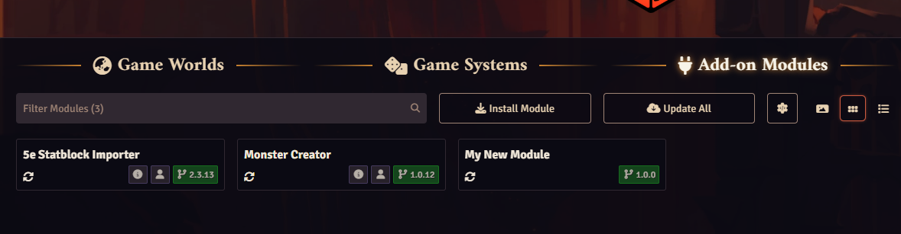
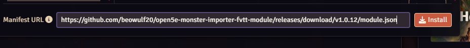
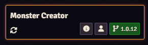
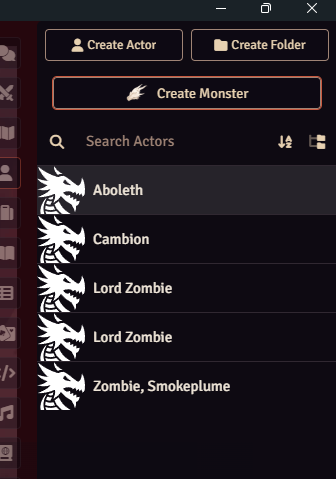
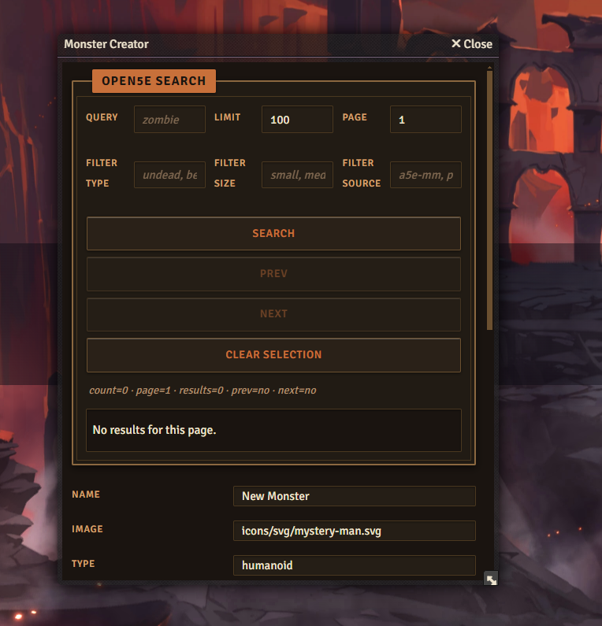
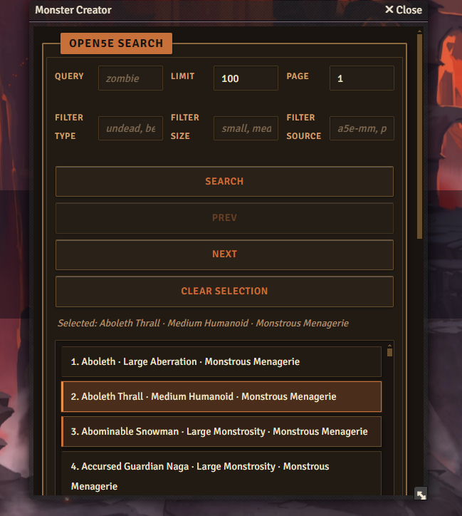
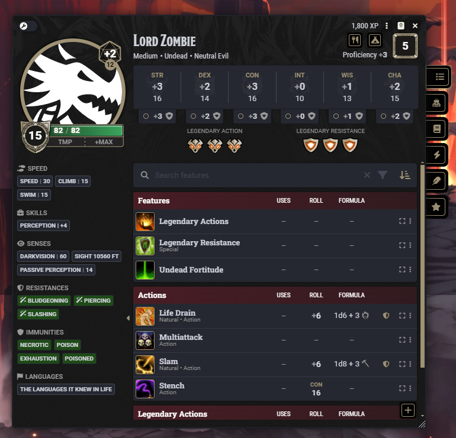

# Monster Creator

Monster Creator is a full Foundry Virtual Tabletop module that adds a **Create Monster** button to the Actor Directory and opens a Foundry form for creating NPC-style monsters with Open5E search.

It is built as a self-contained Foundry module for import via a manifest URL:

- module metadata: `module.json`
- runtime script: `scripts/monster-creator.js`
- form template: `templates/monster-creator-form.hbs`
- module styles: `styles/monster-creator.css`
- local FC5 pack generator: `tools/fc5-compendium/generate-fc5-compendiums.js`

## What this module provides

- Actor Directory button: **Create Monster**
- Open5E-backed monster search and pagination
- NPC actor creation payload that follows DnD5e conventions
- Local/private Fight Club 5e XML conversion into `dnd5e` compendium packs
- Automatic manifest/download URL injection for distribution builds

## Installation

### From a built release

1. In Foundry VTT, open **Module Management**.
2. Use **Install Module** and provide the release manifest URL.
3. Enable **Monster Creator** in your world.
4. Open the Actors tab and use **Create Monster**.

#### Install walkthrough





Use the module manifest URL from the repository’s **Releases** page: `https://github.com/beowulf20/open5e-monster-importer-fvtt-module/releases/latest/download/module.json`.



### Manual install for local testing

From repository root:

```bash
npm install
npm run dev:open
```

Then visit the local test page:

- `http://localhost:4173/monster-creator-test.html`

## Usage

1. Open Foundry and enable the module.
2. In Actor Directory, click **Create Monster**.
3. Use the form search + page controls to find a monster.
4. Review and submit to create the actor.

## FC5 Compendium Generation

This repo can also generate local/private `dnd5e` compendium packs from a Fight Club 5e XML file. The generated pack data is ignored by git and intended for local use only.

Target release used for development:

- `https://github.com/vidalvanbergen/FightClub5eXML/releases/download/2026.02.10/Complete_Compendium_2014+2024.xml`

Install dependencies and generate packs:

```bash
npm install
npm run generate:fc5-compendia -- --xml /path/to/Complete_Compendium_2014+2024.xml
```

That command writes JSON source files under `tmp/fc5-pack-sources/` and compiles module pack data into:

- `monster-creator/packs/fc5-spells`
- `monster-creator/packs/fc5-items`
- `monster-creator/packs/fc5-classes`
- `monster-creator/packs/fc5-subclasses`
- `monster-creator/packs/fc5-features`

Generated documents include mapped Active Effects for common FC5 modifier data such as AC bonuses, weapon/spell attack bonuses, damage bonuses, save bonuses, movement bonuses, ability score bonuses, and subclass/class feature modifiers. Unsupported modifier strings are preserved in document flags for later refinement instead of being dropped.

The module manifest already includes these pack definitions. Regenerate them locally whenever the upstream XML changes.

## Screenshots









## Build and release artifacts

Run the full build from repo root:

```bash
./build-monster-creator.sh
```

Build outputs:

- `dist/monster-creator-v<version>.zip`
- `dist/monster-creator.zip` (release-ready filename)
- `dist/module.json`
- `dist/monster-creator/`

You can host locally to test module install flow:

```bash
MONSTER_CREATOR_BASE_URL=http://127.0.0.1:8000 ./build-monster-creator.sh
cd dist
python3 -m http.server 8000
```

Then in Foundry use:

- `http://127.0.0.1:8000/module.json`

### API endpoint

Default API endpoint in builds is:

- `https://api.open5e.com`

To override for local/proxy use:

```bash
MONSTER_CREATOR_API_REMOTE_URL=http://localhost:8888 ./build-monster-creator.sh
```

## Release tooling

A semantic-release workflow is configured in this repo for release automation. The dry-run command is:

```bash
npm run release:dry-run
```

Release preparation updates both `dist/module.json` and `dist/monster-creator/module.json` so Foundry can install the module with `monster-creator.zip` from the release.

## Credits

- Most of the module work is based on and inspired by [Aioros/5e-statblock-importer](https://github.com/Aioros/5e-statblock-importer).

## Next TODO

- Embed the complete Open5E monster data payload in-module so runtime no longer depends on external API calls.
